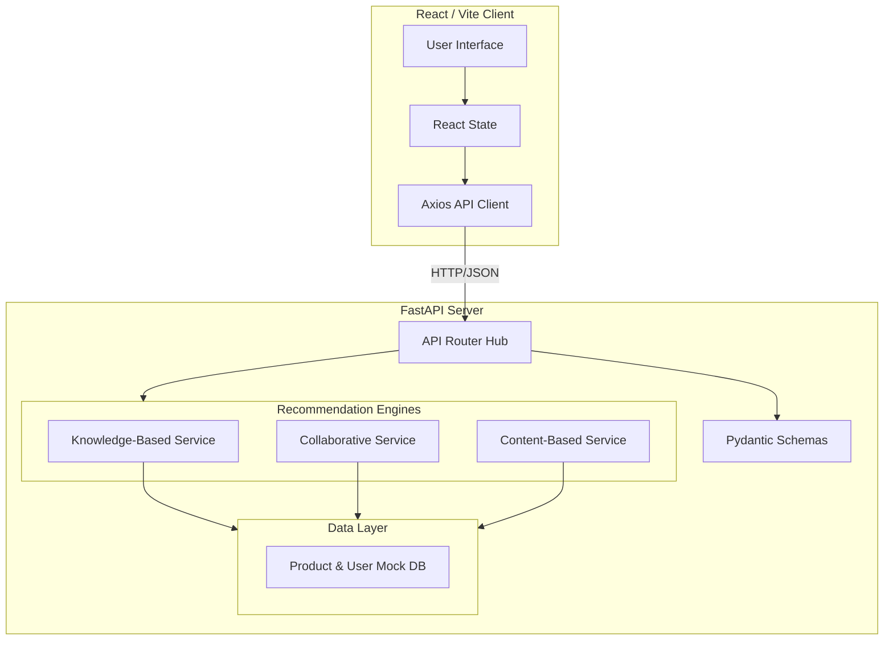

# RecoMix: Intelligent E-Commerce Recommendation System

RecoMix is a premium, high-performance recommendation platform that combines modern agentic design with powerful multi-method recommendation engines. It features a stunning glassmorphism UI, interactive 3D visualizations, and a robust FastAPI backend.

## 🚀 Key Features

- **Multi-Method Recommendations**:
  - **Knowledge-Based**: Expert-driven results using Rule-Based, Constraint-Based, and Utility-Based methods.
  - **Collaborative Filtering**: (Placeholder) User-behavior driven suggestions.
  - **Content-Based**: (Placeholder) Item-similarity driven suggestions.
- **Advanced Visualization**: Interactive 3D bar plots and Recharts-powered comparison dashboards.
- **Agent-Driven Experience**: An interface designed to feel like it is curated by autonomous intelligent agents.
- **Premium UI/UX**: Dark mode aesthetic with glassmorphism, Lucide icons, and zero-emoji professional design.

---

## 🏗️ Architecture

The system follows a modern layered architecture, separating concerns between the presentation layer, the API routing layer, and the core recommendation services.



### Technical Stack

- **Frontend**: React 19, Vite 8, Recharts (Data Viz), Lucide React (Icons).
- **Backend**: FastAPI, Uvicorn, Pydantic (Validation).
- **Styling**: Vanilla CSS with custom design tokens for Glassmorphism and 3D interactions.

---

## 🛠️ Getting Started

### Prerequisites
- Node.js (v18+)
- Python (v3.10+)

### 1. Backend Setup
```bash
cd backend
python -m venv venv
source venv/bin/activate  # On Windows: venv\Scripts\activate
pip install -r requirements.txt
uvicorn main:app --reload
```
The backend will be available at `http://localhost:8000`.

### 2. Frontend Setup
```bash
cd frontend
npm install
npm run dev
```
The frontend will be available at `http://localhost:5173`.

---

## 🧠 Knowledge-Based AI Methods

RecoMix supports three distinct engines within its Knowledge AI module:

1.  **Rule-Based**: Strict logic. Products must satisfy every constraint provided by the user.
2.  **Constraint-Based**: Flexible ranking. Balances hard constraints with soft user preferences.
3.  **Utility-Based**: Weighted scoring. Assigns importance values to product attributes (price, rating, features) to find the mathematical "best match."

---

## 📜 Project Structure

```text
/
├── frontend/
│   ├── src/
│   │   ├── components/  # Reusable UI components (ProductCard, Navbar)
│   │   ├── pages/       # Page views (KnowledgeBased, Recommendations)
│   │   ├── services/    # API communication layer
│   │   └── styles/      # Design system and global CSS
│   └── index.html
├── backend/
│   ├── routers/         # API endpoint definitions
│   ├── services/        # Recommendation logic engines
│   ├── models/          # Data definitions
│   ├── schemas/         # Pydantic validation models
│   └── main.py          # Application entry point
└── README.md
```

---

## 🤝 Contributing
This project is part of a senior-level Intelligent Recommendation Systems study. Contributions are welcome through pull requests.

## 📄 License
This project is licensed under the MIT License.
