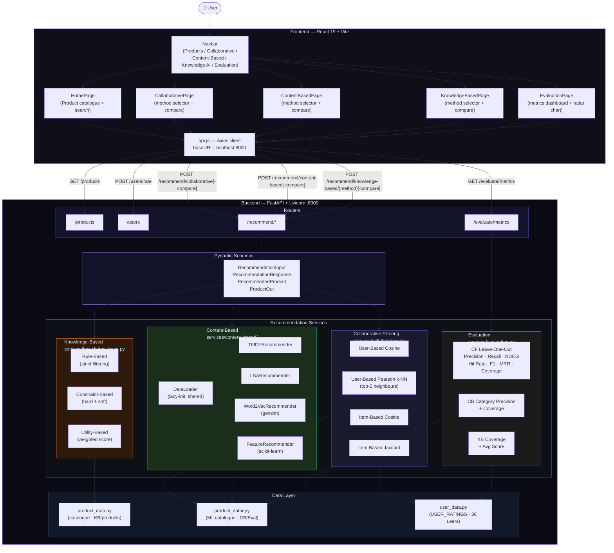
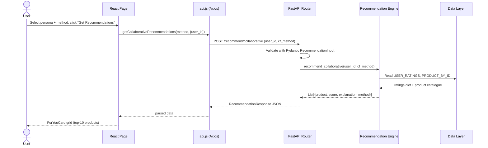
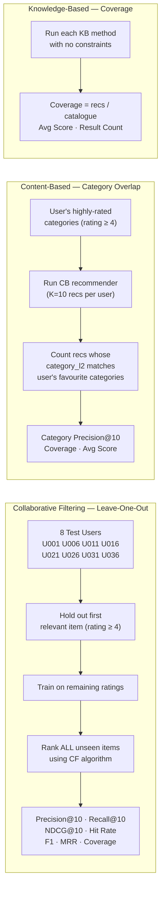

# RecoMix — Intelligent E-Commerce Recommendation System

> AIE425 Intelligent Systems · Full-stack multi-method recommendation platform

RecoMix is a full-stack recommendation engine that implements and compares **three families of recommendation algorithms** — Collaborative Filtering, Content-Based, and Knowledge-Based — through a unified dark-mode React interface with live side-by-side comparison, offline evaluation metrics, and interactive charts.

---

## Features

| Area | Details |
|---|---|
| Collaborative Filtering | User-Based Cosine, User-Based Pearson k-NN, Item-Based Cosine, Item-Based Jaccard |
| Content-Based | TF-IDF, LSA, Word2Vec (gensim), Feature-Based (scikit-learn) |
| Knowledge-Based | Rule-Based, Constraint-Based, Utility-Based |
| Evaluation | Leave-one-out Precision@10, Recall@10, NDCG@10, Hit Rate, F1, MRR, Coverage (CF) · Category Precision, Coverage (CB) · Coverage, Avg Score (KB) |
| Compare Mode | Side-by-side column view + bar chart for all methods within each family |
| UI | Glassmorphism dark theme · Recharts radar & bar charts · Fully responsive |

---

## Full Pipeline Architecture



---

## Request Flow (single recommendation)



---

## Evaluation Methodology



---

## Tech Stack

**Frontend**
- React 19 + Vite 6
- React Router DOM 7
- Recharts (BarChart, RadarChart)
- Lucide React (icons)
- Vanilla CSS with custom design tokens (glassmorphism)
- Axios

**Backend**
- FastAPI 0.115 + Uvicorn
- Pydantic 2.9
- scikit-learn (TF-IDF, LSA / TruncatedSVD, Feature-Based cosine)
- gensim (Word2Vec)
- NumPy + pandas + SciPy

---

## Project Structure

```
AIE425-recommendation-system/
├── backend/
│   ├── main.py                        # FastAPI app, router registration
│   ├── requirements.txt
│   ├── models/
│   │   ├── product_data.py            # Product catalogue (KB / homepage)
│   │   ├── product_datar.py           # ML product catalogue (CB / Eval)
│   │   └── user_data.py               # USER_RATINGS (36 synthetic users)
│   ├── schemas/
│   │   └── schemas.py                 # Pydantic I/O models
│   ├── routers/
│   │   ├── products.py                # GET /products, /products/{id}, meta
│   │   ├── users.py                   # POST /users/rate, GET /users/ratings
│   │   ├── recommender.py             # POST /recommend/* (all methods)
│   │   └── evaluation.py              # GET /evaluate/metrics
│   └── services/
│       ├── collaborative.py           # 4 CF algorithms + compare
│       ├── knowledge_base.py          # Rule / Constraint / Utility engines
│       ├── evaluation.py              # Offline evaluation (LOO + CB + KB)
│       └── content_based/
│           ├── data_loader.py         # Shared lazy data loader
│           ├── base_recommender.py    # Abstract base class
│           ├── tfidf_recommender.py   # TF-IDF cosine similarity
│           ├── lsa_recommender.py     # TruncatedSVD + cosine
│           ├── word2vec_recommender.py# gensim Word2Vec embeddings
│           └── feature_recommender.py # Structured attribute similarity
├── frontend/
│   ├── index.html
│   ├── vite.config.js
│   └── src/
│       ├── App.jsx                    # Route definitions
│       ├── index.css                  # Design tokens + global styles
│       ├── components/
│       │   ├── Navbar.jsx / .css
│       │   ├── ForYouCard.jsx / .css  # Unified recommendation card
│       │   ├── ProductCard.jsx / .css
│       │   └── RecommendationCard.jsx / .css
│       ├── pages/
│       │   ├── HomePage.jsx / .css    # Product catalogue + search
│       │   ├── CollaborativePage.jsx  # CF — method select + compare
│       │   ├── ContentBasedPage.jsx   # CB — method select + compare
│       │   ├── KnowledgeBasedPage.jsx # KB — method select + compare
│       │   ├── EvaluationPage.jsx / .css  # Metrics dashboard
│       │   ├── RecommendPage.css      # Shared layout (CF · CB · KB)
│       │   └── ProductDetailPage.jsx / .css
│       └── services/
│           └── api.js                 # Axios calls for all endpoints
└── README.md
```

---

## Getting Started

### Prerequisites
- Python 3.10+, pip
- Node.js 18+, npm

### Backend

```bash
# From the project root
cd backend
python -m venv venv
source venv/bin/activate        # Windows: venv\Scripts\activate
pip install -r requirements.txt

# Run from the project root (not from inside backend/)
cd ..
uvicorn backend.main:app --reload
# → http://localhost:8000
# → http://localhost:8000/docs  (Swagger UI)
```

> **Apple Silicon note:** If you have conda active alongside a venv, use the explicit path:
> `./backend/venv/bin/python -m uvicorn backend.main:app --reload`

### Frontend

```bash
cd frontend
npm install
npm run dev
# → http://localhost:5173
```

---

## API Endpoints

| Method | Path | Description |
|--------|------|-------------|
| GET | `/products` | Product catalogue (search, filter, paginate) |
| GET | `/products/{id}` | Single product detail |
| GET | `/products/meta/categories` | Available categories |
| GET | `/products/meta/brands` | Available brands |
| POST | `/users/rate` | Submit a product rating |
| GET | `/users/ratings/{user_id}` | Fetch a user's ratings |
| POST | `/recommend/collaborative` | CF recommendation (single method) |
| POST | `/recommend/collaborative-compare` | CF comparison (all 4 methods) |
| POST | `/recommend/content-based` | CB recommendation (single method) |
| POST | `/recommend/content-based-compare` | CB comparison (all 4 methods) |
| POST | `/recommend/knowledge-based/{method}` | KB recommendation (rule / constraint / utility) |
| POST | `/recommend/knowledge-based-compare` | KB comparison (all 3 methods) |
| GET | `/evaluate/metrics` | Offline evaluation metrics for all methods |

---

## Collaborative Filtering Algorithms

| Algorithm | Similarity | Neighbourhood |
|---|---|---|
| User-Based Cosine | Cosine on rating vectors | All users with positive similarity |
| User-Based Pearson k-NN | Mean-centred Pearson correlation | Top-5 most similar users |
| Item-Based Cosine | Cosine on user-rating vectors | All items with positive similarity |
| Item-Based Jaccard | Jaccard on implicit positive sets (rating ≥ 3.5) | All co-rated items |

---

## Content-Based Algorithms

| Algorithm | Representation | Similarity |
|---|---|---|
| TF-IDF | Bag-of-words TF-IDF matrix | Cosine |
| LSA | TruncatedSVD(100) on TF-IDF | Cosine in latent space |
| Word2Vec | Gensim Word2Vec, doc vectors = mean of token embeddings | Cosine |
| Feature-Based | One-hot category + brand + normalised price/rating | Cosine |

---

## Knowledge-Based Methods

| Method | Logic |
|---|---|
| Rule-Based | Hard filter: products must satisfy every active constraint (budget, category, brand, min rating) |
| Constraint-Based | Hard constraints required; soft preferences (brand affinity, feature weights) used for ranking |
| Utility-Based | Weighted scoring function over price (lower = better), rating, brand match, and feature overlap |

---

## Evaluation Results Summary

Metrics are computed offline at first request and cached. CF uses leave-one-out on 8 held-out test users with K=10.

| Family | Key Metric | Best Method |
|---|---|---|
| Collaborative Filtering | NDCG@10, Precision@10 | Varies by user set |
| Content-Based | Category Precision@10 | Determined at runtime |
| Knowledge-Based | Catalogue Coverage | Utility-Based (broadest scoring) |

Visit `/evaluation` in the UI for the full interactive dashboard with radar chart cross-family comparison.

---

## License

MIT — academic project, AIE425 Intelligent Systems.
